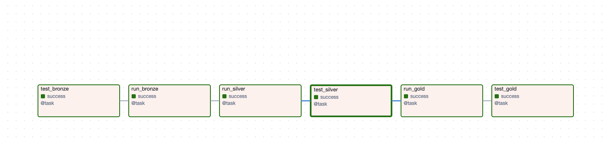
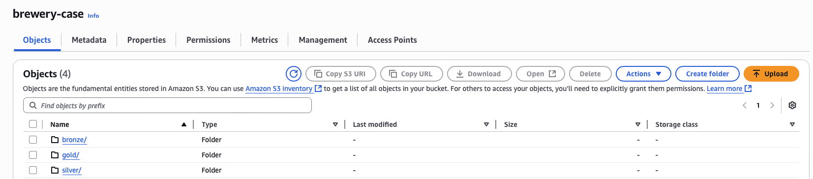
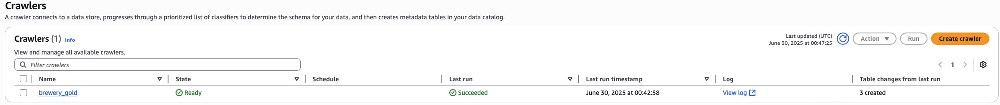
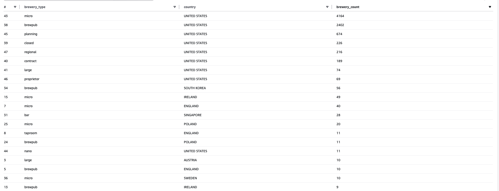

# Brewery Data Pipeline - Engenharia de Dados com Airflow, Spark e AWS

Este projeto implementa um pipeline de engenharia de dados baseado na arquitetura em camadas **Bronze → Silver → Gold**, utilizando **Astronomer Airflow** para orquestração, **PySpark** para transformação, **AWS S3** para armazenamento, **AWS Glue** como catálogo de dados e **AWS Athena** para consulta via SQL.
---
## Instalacoes necessarias
- [Docker](https://www.docker.com/get-started/)
- [Astronomer CLI](https://docs.astronomer.io/astro/cli/install-cli)

---
## Tecnologias Utilizadas

- **Astronomer Airflow** – Orquestração de tarefas
- **PySpark** – Processamento de dados em larga escala
- **AWS S3** – Armazenamento das camadas Bronze, Silver e Gold
- **AWS Glue** – Catálogo de dados para uso com Athena
- **AWS Athena** – Consulta de dados usando SQL diretamente no S3
- **Docker** – Containerização do ambiente
- **Pytest** – Testes unitários para validação de cada camada
- **dotenv** – Gerenciamento de variáveis sensíveis

---

## Arquitetura em Camadas

```text
API Pública
   ↓
[ Bronze ] → Dados brutos
   ↓
[ Silver ] → Dados limpos, normalizados, com timestamp
   ↓
[ Gold ] → Dados prontos para análise com Athena
```

---

## Estrutura do Projeto

```
brewery_case/
├── dags/
│   └── brewery_dag.py                # DAG do Airflow
├── scripts/
│   ├── bronze/
│   │   └── raw_ingest.py             # Ingestão da API para Bronze
│   ├── silver/
│   │   └── silver_ingestion.py       # Transformações para Silver
│   └── gold/
│       └── gold_ingestion.py         # Agregações e partições para Gold
├── tests/
│   ├── bronze/
|   |   └── test_raw_ingestion.py
│   ├── silver/
|   |   └── test_silver.py
│   └── gold/
|       └── test_gold.py
├── Dockerfile                        # Imagem customizada com PySpark e Java
├── requirements.txt
└── .env                              # Variáveis sensíveis
```

---

## Execução do Pipeline

A DAG do Airflow é composta pelas seguintes tarefas:

1. `run_bronze` → Ingestão da API e gravação no S3
2. `test_bronze` → Validação dos dados brutos com Pytest
3. `run_silver` → Limpeza e transformação da Bronze
4. `test_silver` → Validação dos dados tratados
5. `run_gold` → Agregações e preparação para análise
6. `test_gold` → Validação final antes da análise

As tarefas estão encadeadas com dependências, garantindo execução ordenada e segura.

---

##  Testes Automatizados

Cada camada possui seus testes organizados:

```bash
# Testes individuais
pytest tests/bronze/test_raw_ingestion.py
pytest tests/silver/test_silver.py
pytest tests/gold/test_gold.py
```

Os testes são executados automaticamente via Airflow entre as etapas do pipeline.

---

##  Como Rodar com Astro

```bash
# Inicialização com Astro
astro dev start
```

---

## 🔐 Arquivo `.env`

Crie um arquivo `.env` na raiz com as credenciais da AWS:

```env
AIRFLOW__SMTP__SMTP_HOST=smtp.gmail.com
AIRFLOW__SMTP__SMTP_STARTTLS=True
AIRFLOW__SMTP__SMTP_SSL=False
AIRFLOW__SMTP__SMTP_USER=Seu email
AIRFLOW__SMTP__SMTP_PORT=587
AIRFLOW__SMTP__SMTP_PASSWORD=Sua Senha 
AIRFLOW__EMAIL__EMAIL_BACKEND=airflow.utils.email.send_email_smtp
AWS_ACCESS_KEY_ID=SEU_ACCESS_KEY
AWS_SECRET_ACCESS_KEY=SUA_SECRET_KEY
AWS_S3_BUCKET=seu bucket
```
obs: caso for gmail faça uma senha para aplicativo e habilite autenticação em dois fatores

---

## 📊 Consulta com AWS Athena

1. Acesse o serviço **AWS Glue**
2. Crie um **Crawler** apontando para `s3://<seu-bucket>/gold/`
3. Rode o crawler e crie uma tabela no Glue Data Catalog
4. Vá até o **AWS Athena** e execute:

```sql
SELECT country, COUNT(*) as total
FROM gold
GROUP BY country
ORDER BY total DESC;
```

---

## Detalhes de Cada Camada

###  Bronze
- Dados coletados da API pública Open Brewery DB
- Formato: `.parquet`
- Local: `s3a://<bucket>/bronze/`

###  Silver
- Dados tratados: trim em colunas, uppercase, remoção de nulos
- Adicionado timestamp de processamento
- Particionado por `country`
- Local: `s3a://<bucket>/silver/`

### Gold
- Dados prontos para análise
- Pode conter agregações como total por país e tipo de brewery
- Particionado para performance
- Local: `s3a://<bucket>/gold/`

---

## Melhorias Futuras

- CI/CD com GitHub Actions
- Observabilidade com Datadog ou Prometheus
- Validação de schema com Great Expectations
- Uso de Delta Lake ou Iceberg para versionamento

---
# Screenshots

### Airflow - DAG Pipeline


### AWS S3 - Camadas de Dados


### AWS Glue - Catálogo de Dados


### AWS Athena - Consulta na Camada Gold


---
## 👨‍💻 Autor

Gabriel Almeida  
📧 gabriel.almeida99.job@gmail.com  
🔗 [LinkedIn](https://www.linkedin.com/in/gabriel-almeida-129343190/)

---

## 🏁 Conclusão

Este projeto demonstra um pipeline de engenharia de dados completo, com ingestão, transformação e preparação para análise via AWS Athena. A modularidade permite fácil manutenção e escalabilidade, além de boas práticas com testes e orquestração profissional com Astronomer Airflow.